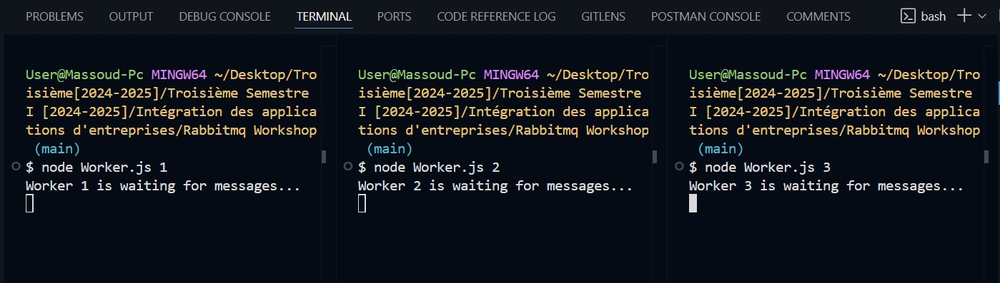
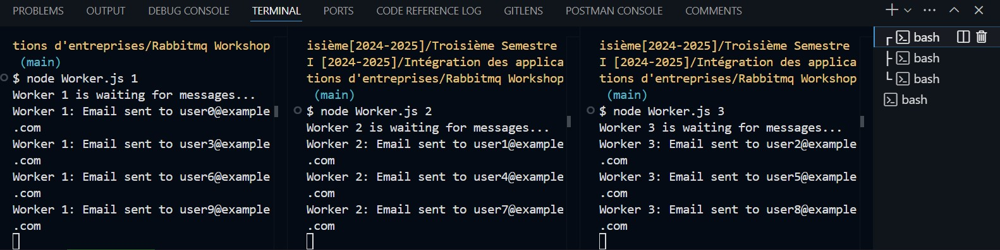

# Email Queue System

This project demonstrates a simple email queue system using RabbitMQ. It consists of two main components: a producer and a worker. The producer sends email messages to a queue, and the worker processes these messages.

## Prerequisites

- Node.js
- RabbitMQ

## Installation

1. Clone the repository:
    ```sh
    git clone <repository-url>
    cd <repository-directory>
    ```

2. Install the dependencies:
    ```sh
    npm install
    ```

3. Make sure RabbitMQ is running on your local machine.

## Usage

### Producer

The producer sends email messages to the `emailQueue`.

To run the producer:
```sh
node [producer.js]
```
### Worker
To run the worker:
```sh
node [worker.js] <workerId>
```
Email Queue:

Workers Waiting:

Workers Upon Success:


